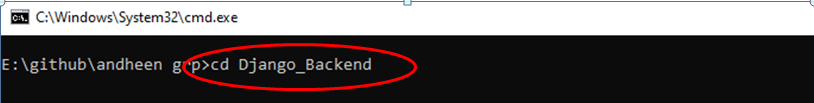
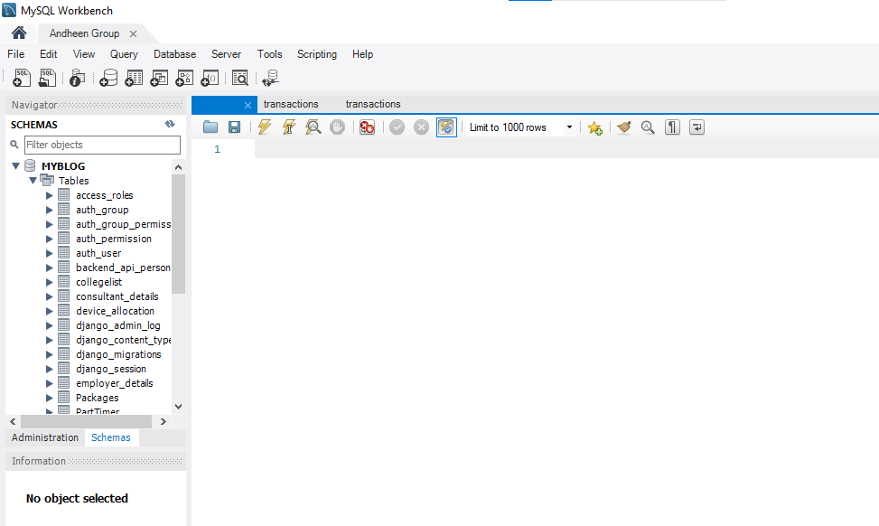

# Steps to follow to install and run the File of ANDDHEN Group

Welcome! to Anddhen Grouop. Follow the steps correctly to download and run the files

**Note: Downlod Git bash and Nodejs pre installed before starting the process**

Use this link to download the git bash: [https://www.youtube.com/watch?v=cJTXh7g-uCM](https://www.youtube.com/watch?v=cJTXh7g-uCM)

Use this link to download the NodeJs: [https://www.youtube.com/watch?v=06X51c6WHsQ](https://www.youtube.com/watch?v=06X51c6WHsQ)

**Note: This links may not work for your device refer other resources to download properly**

## Steps to downlod the Backend

Follow the Steps correctly to download the Back end

**Click the link given below**

### `https://github.com/AbhiGattineni/Django_Backend`

This Github link [https://github.com/AbhiGattineni/Django_Backend](https://github.com/AbhiGattineni/Django_Backend) will open the files of AnddhenGroup Back end.

**Click on the Code Button**

it wil open an a window

**Copy the link From the Window**

**Go to the folder which was created(Ex:AnddhenGroup)**

**Now open Command prompt using cmd command and press Enter**

### `cmd`

**Enter command "git clone <copied link from git hub>" and press enter**

### `git clone <link>`

wait till the command to exacute

**Enter command "cd Django_Backend" and press enter**

### `cd Django_Backend`

**Enter command "code ." and press enter**

### `cd Django_Backend`

this command will take you to vs code

**OR**

You can open vs code directly and open the folder ""Anddhen-group" which is present in the Folder which You have created.

**create a file in the Repositery with Name .env**

### `.env`

this file is used to Maintain the credentials

**Note: Create the file in the Anddhen-group folder not in any sub folders**

**Ask the Credentials from the authorised person and paste them in the .env file and save the file**

after completing of the above steps

**Open a New temrminal in vscode using this steps**

**OR**

**use short cut ctrl + shift + ` to open new terminal**

**open a Git bash terminl**

**Enter the command "pip install -r requirements.txt"**

### `pip install -r requirements.txt`

this command is used to install all packages required

**Note: Make sure that all packages are installed without any errors**

after the complete execution of the command

**Enter the command "python manage.py runserver"**

### `python manage.py runserver`

this command will add backend functionality.

# Connect to a Database with MySQL Workbench

MySQL Workbench is a popular graphical tool for working with MySQL databases. This multifunctional tool is compatible
with various platforms, including Windows, Linux, and macOS.

## Download and Install MySQL Workbench

You can obtain MySQL Workbench at no cost directly from
the [MySQL official website](https://www.mysql.com/products/workbench/).

After downloading the appropriate version of MySQL Workbench that corresponds to your operating system, proceed with the
installation by following the guidelines specific to your OS.

### Prerequisites

- Ensure MySQL Workbench is installed on your computer. If not, you can download and install it from
  the [MySQL website](https://www.mysql.com/products/workbench/).
- Have the necessary credentials for the MySQL database you want to connect to obtained from the dedicated project page.

### Steps to Connect to a MySQL Database

#### 1. Open MySQL Workbench

Launch MySQL Workbench on your computer. You will see the home screen.

#### 2. Create a New Connection

- On the home screen, click on the "+" symbol next to "MySQL Connections" to create a new connection.

- This opens the "Setup New Connection" dialog.

#### 3. Configure Connection Settings

In the "Setup New Connection" dialog, enter the following details:

- **Connection Name**: Give a descriptive name to your connection. This can be anything to help you remember which
  database this connection refers to.
- **Connection Method**: Choose "Standard (TCP/IP)" for most cases.
- **Hostname**: Enter the IP address or domain name of your MySQL server. If the server is on your local machine,
  use, `database.ctnj0eswvoik.us-west-2.rds.amazonaws.com`.
- **Port**: The default MySQL port is `3306`. We will keep it as is.
- **Username**: Enter the username you use to access the database, it is `root` in our case.

- **Password**: Click on "Store in Vault" and enter your password if you wish to save it. Otherwise, you'll be prompted
  to enter it each time you connect.
  **Please Take the password from Authorities of Andheen Group**

  

#### 4. Test the Connection

- Click on the "Test Connection" button to make sure the details are correct and MySQL Workbench can connect to the
  database. If there's an error, it will provide a message, and you'll need to verify your settings. Otherwise you should see
  a prompt with the message "Successfully made the MySQL connection".

#### 5. Connect to the Database

- After a successful test, click "OK" to save the connection.
- Back on the home screen, you will see your new connection listed under "MySQL Connections."

- Click on the connection icon to connect to your MySQL database. If you didn't save your password, you'll be prompted
  to enter it now. If it is working you should see a connecting windows like the below screenshot.

#### 6. Using MySQL Workbench

- Once connected, you can use the Workbench interface to run SQL queries, manage databases, and perform various database
  operations.

