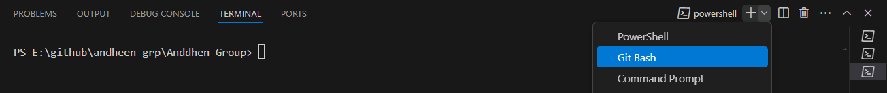

# Steps to follow to install and run the File of ANDDHEN Group

Welcome! to Anddhen Grouop. Follow the steps correctly to download and run the files

**Note: Downlod Git bash and Nodejs pre installed before starting the process**

Use this link to download the git bash: [https://www.youtube.com/watch?v=cJTXh7g-uCM](https://www.youtube.com/watch?v=cJTXh7g-uCM)

Use this link to download the NodeJs: [https://www.youtube.com/watch?v=06X51c6WHsQ](https://www.youtube.com/watch?v=06X51c6WHsQ)

**Note: This links may not work for your device refer other resources to download properly**

## Steps to downlod the Backend

Follow the Steps correctly to download the Back end

**Click the link given below**

### `https://github.com/AbhiGattineni/Django_Backend`

This Github link [https://github.com/AbhiGattineni/Django_Backend](https://github.com/AbhiGattineni/Django_Backend) will open the files of AnddhenGroup Back end.

**Click on the Code Button**

it wil open an a window

**Copy the link From the Window**

**Go to the folder which was created(Ex:AnddhenGroup)**

**Now open Command prompt using cmd command and press Enter**

### `cmd`

**Enter command "git clone <copied link from git hub>" and press enter**

### `git clone <link>`

wait till the command to exacute

**Enter command "cd Django_Backend" and press enter**

### `cd Django_Backend`

**Enter command "code ." and press enter**

### `cd Django_Backend`

this command will take you to vs code

**OR**

You can open vs code directly and open the folder ""Anddhen-group" which is present in the Folder which You have created.

**create a file in the Repositery with Name .env**

### `.env`

this file is used to Maintain the credentials

**Note: Create the file in the Anddhen-group folder not in any sub folders**

**Ask the Credentials from the authorised person and paste them in the .env file and save the file**

after completing of the above steps

**Open a New temrminal in vscode using this steps**

**OR**

**use short cut ctrl + shift + `  to open new terminal**

**open a Git bash terminl**

**Enter the command "pip install -r requirements.txt"**

### `pip install -r requirements.txt`

this command is used to install all packages required

**Note: Make sure that all packages are installed without any errors**

after the complete execution of the command

**Enter the command "python manage.py runserver"**

### `python manage.py runserver`

this command will add backend functionality.
